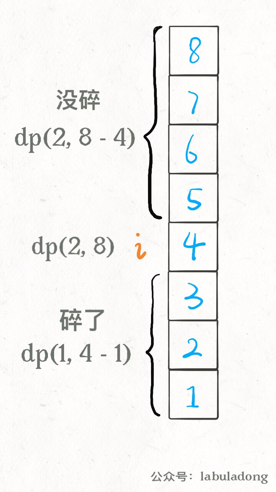
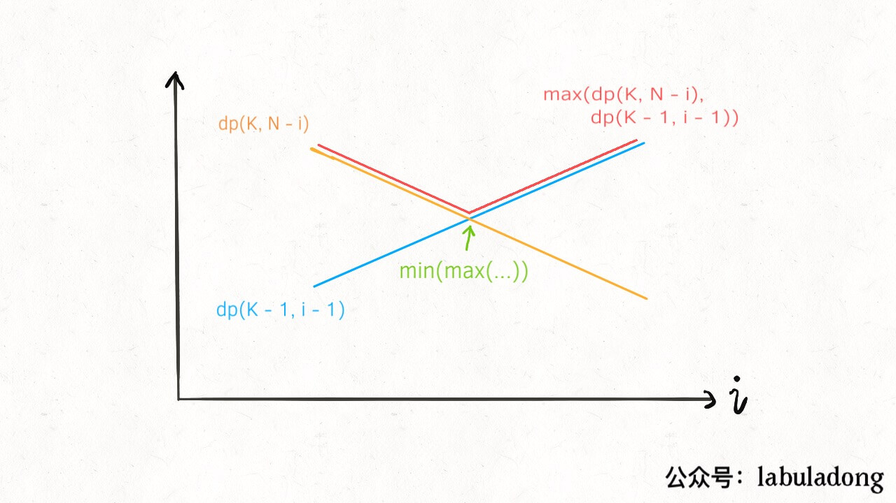

# 经典动态规划问题：高楼扔鸡蛋

<p align='center'>
<a href="https://github.com/labuladong/fucking-algorithm" target="view_window"></a>
<a href="https://www.zhihu.com/people/labuladong"></a>
<a href="https://i.loli.net/2020/10/10/MhRTyUKfXZOlQYN.jpg"></a>
<a href="https://space.bilibili.com/14089380"></a>
</p>
相关推荐：
  * [如何判断回文链表](https://labuladong.gitbook.io/algo)
  * [SQL进阶技巧](https://labuladong.gitbook.io/algo)

读完本文，你不仅学会了算法套路，还可以顺便去 LeetCode 上拿下如下题目：

[887.鸡蛋掉落](https://leetcode-cn.com/problems/super-egg-drop/)

---

今天要聊一个很经典的算法问题，若干层楼，若干个鸡蛋，让你算出最少的尝试次数，找到鸡蛋恰好摔不碎的那层楼。国内大厂以及谷歌脸书面试都经常考察这道题，只不过他们觉得扔鸡蛋太浪费，改成扔杯子，扔破碗什么的。

具体的问题等会再说，但是这道题的解法技巧很多，光动态规划就好几种效率不同的思路，最后还有一种极其高效数学解法。秉承咱们号一贯的作风，拒绝奇技淫巧，拒绝过于诡异的技巧，因为这些技巧无法举一反三，学了也不划算。

下面就来用我们一直强调的动态规划通用思路来研究一下这道题。

### 一、解析题目

题目是这样：你面前有一栋从 1 到 `N` 共 `N` 层的楼，然后给你 `K` 个鸡蛋（`K` 至少为 1）。现在确定这栋楼存在楼层 `0 <= F <= N`，在这层楼将鸡蛋扔下去，鸡蛋**恰好没摔碎**（高于 `F` 的楼层都会碎，低于 `F` 的楼层都不会碎）。现在问你，**最坏**情况下，你**至少**要扔几次鸡蛋，才能**确定**这个楼层 `F` 呢？

也就是让你找摔不碎鸡蛋的最高楼层 `F`，但什么叫「最坏情况」下「至少」要扔几次呢？我们分别举个例子就明白了。

比方说**现在先不管鸡蛋个数的限制**，有 7 层楼，你怎么去找鸡蛋恰好摔碎的那层楼？

最原始的方式就是线性扫描：我先在 1 楼扔一下，没碎，我再去 2 楼扔一下，没碎，我再去 3 楼……

以这种策略，**最坏**情况应该就是我试到第 7 层鸡蛋也没碎（`F = 7`），也就是我扔了 7 次鸡蛋。

先在你应该理解什么叫做「最坏情况」下了，**鸡蛋破碎一定发生在搜索区间穷尽时**，不会说你在第 1 层摔一下鸡蛋就碎了，这是你运气好，不是最坏情况。

现在再来理解一下什么叫「至少」要扔几次。依然不考虑鸡蛋个数限制，同样是 7 层楼，我们可以优化策略。

最好的策略是使用二分查找思路，我先去第 `(1 + 7) / 2 = 4` 层扔一下：

如果碎了说明 `F` 小于 4，我就去第 `(1 + 3) / 2 = 2` 层试……

如果没碎说明 `F` 大于等于 4，我就去第 `(5 + 7) / 2 = 6` 层试……

以这种策略，**最坏**情况应该是试到第 7 层鸡蛋还没碎（`F = 7`），或者鸡蛋一直碎到第 1 层（`F = 0`）。然而无论那种最坏情况，只需要试 `log7` 向上取整等于 3 次，比刚才尝试 7 次要少，这就是所谓的**至少**要扔几次。

PS：这有点像 Big O 表示法计算​算法的复杂度。

实际上，如果不限制鸡蛋个数的话，二分思路显然可以得到最少尝试的次数，但问题是，**现在给你了鸡蛋个数的限制 `K`，直接使用二分思路就不行了**。

比如说只给你 1 个鸡蛋，7 层楼，你敢用二分吗？你直接去第 4 层扔一下，如果鸡蛋没碎还好，但如果碎了你就没有鸡蛋继续测试了，无法确定鸡蛋恰好摔不碎的楼层 `F` 了。这种情况下只能用线性扫描的方法，算法返回结果应该是 7。

有的读者也许会有这种想法：二分查找排除楼层的速度无疑是最快的，那干脆先用二分查找，等到只剩 1 个鸡蛋的时候再执行线性扫描，这样得到的结果是不是就是最少的扔鸡蛋次数呢？

很遗憾，并不是，比如说把楼层变高一些，100 层，给你 2 个鸡蛋，你在 50 层扔一下，碎了，那就只能线性扫描 1～49 层了，最坏情况下要扔 50 次。

如果不要「二分」，变成「五分」「十分」都会大幅减少最坏情况下的尝试次数。比方说第一个鸡蛋每隔十层楼扔，在哪里碎了第二个鸡蛋一个个线性扫描，总共不会超过 20 次​。

最优解其实是 14 次。最优策略非常多，而且并没有什么规律可言。

说了这么多废话，就是确保大家理解了题目的意思，而且认识到这个题目确实复杂，就连我们手算都不容易，如何用算法解决呢？

### 二、思路分析

对动态规划问题，直接套我们以前多次强调的框架即可：这个问题有什么「状态」，有什么「选择」，然后穷举。

**「状态」很明显，就是当前拥有的鸡蛋数 `K` 和需要测试的楼层数 `N`**。随着测试的进行，鸡蛋个数可能减少，楼层的搜索范围会减小，这就是状态的变化。

**「选择」其实就是去选择哪层楼扔鸡蛋**。回顾刚才的线性扫描和二分思路，二分查找每次选择到楼层区间的中间去扔鸡蛋，而线性扫描选择一层层向上测试。不同的选择会造成状态的转移。

现在明确了「状态」和「选择」，**动态规划的基本思路就形成了**：肯定是个二维的 `dp` 数组或者带有两个状态参数的 `dp` 函数来表示状态转移；外加一个 for 循环来遍历所有选择，择最优的选择更新状态：

```python
# 当前状态为 K 个鸡蛋，面对 N 层楼
# 返回这个状态下的最优结果
def dp(K, N):
    int res
    for 1 <= i <= N:
        res = min(res, 这次在第 i 层楼扔鸡蛋)
    return res
```

这段伪码还没有展示递归和状态转移，不过大致的算法框架已经完成了。

我们选择在第 `i` 层楼扔了鸡蛋之后，可能出现两种情况：鸡蛋碎了，鸡蛋没碎。**注意，这时候状态转移就来了**：

**如果鸡蛋碎了**，那么鸡蛋的个数 `K` 应该减一，搜索的楼层区间应该从 `[1..N]` 变为 `[1..i-1]` 共 `i-1` 层楼；

**如果鸡蛋没碎**，那么鸡蛋的个数 `K` 不变，搜索的楼层区间应该从  `[1..N]` 变为 `[i+1..N]` 共 `N-i` 层楼。



PS：细心的读者可能会问，在第i层楼扔鸡蛋如果没碎，楼层的搜索区间缩小至上面的楼层，是不是应该包含第i层楼呀？不必，因为已经包含了。开头说了 F 是可以等于 0 的，向上递归后，第i层楼其实就相当于第 0 层，可以被取到，所以说并没有错误。

因为我们要求的是**最坏情况**下扔鸡蛋的次数，所以鸡蛋在第 `i` 层楼碎没碎，取决于那种情况的结果**更大**：

```python
def dp(K, N):
    for 1 <= i <= N:
        # 最坏情况下的最少扔鸡蛋次数
        res = min(res, 
                  max( 
                        dp(K - 1, i - 1), # 碎
                        dp(K, N - i)      # 没碎
                     ) + 1 # 在第 i 楼扔了一次
                 )
    return res
```

递归的 base case 很容易理解：当楼层数 `N` 等于 0 时，显然不需要扔鸡蛋；当鸡蛋数 `K` 为 1 时，显然只能线性扫描所有楼层：

```python
def dp(K, N):
    if K == 1: return N
    if N == 0: return 0
    ...
```

至此，其实这道题就解决了！只要添加一个备忘录消除重叠子问题即可：

```python
def superEggDrop(K: int, N: int):

    memo = dict()
    def dp(K, N) -> int:
        # base case
        if K == 1: return N
        if N == 0: return 0
        # 避免重复计算
        if (K, N) in memo:
            return memo[(K, N)]

        res = float('INF')
        # 穷举所有可能的选择
        for i in range(1, N + 1):
            res = min(res, 
                      max(
                            dp(K, N - i), 
                            dp(K - 1, i - 1)
                         ) + 1
                  )
        # 记入备忘录
        memo[(K, N)] = res
        return res
    
    return dp(K, N)
```

这个算法的时间复杂度是多少呢？**动态规划算法的时间复杂度就是子问题个数 × 函数本身的复杂度**。

函数本身的复杂度就是忽略递归部分的复杂度，这里 `dp` 函数中有一个 for 循环，所以函数本身的复杂度是 O(N)。

子问题个数也就是不同状态组合的总数，显然是两个状态的乘积，也就是 O(KN)。

所以算法的总时间复杂度是 O(K*N^2), 空间复杂度 O(KN)。

### 三、疑难解答

这个问题很复杂，但是算法代码却十分简洁，这就是动态规划的特性，穷举加备忘录/DP table 优化，真的没啥新意。

首先，有读者可能不理解代码中为什么用一个 for 循环遍历楼层 `[1..N]`，也许会把这个逻辑和之前探讨的线性扫描混为一谈。其实不是的，**这只是在做一次「选择」**。

比方说你有 2 个鸡蛋，面对 10 层楼，你**这次**选择去哪一层楼扔呢？不知道，那就把这 10 层楼全试一遍。至于下次怎么选择不用你操心，有正确的状态转移，递归会算出每个选择的代价，我们取最优的那个就是最优解。

另外，这个问题还有更好的解法，比如修改代码中的 for 循环为二分搜索，可以将时间复杂度降为 O(K\*N\*logN)；再改进动态规划解法可以进一步降为 O(KN)；使用数学方法解决，时间复杂度达到最优 O(K*logN)，空间复杂度达到 O(1)。

二分的解法也有点误导性，你很可能以为它跟我们之前讨论的二分思路扔鸡蛋有关系，实际上没有半毛钱关系。能用二分搜索是因为状态转移方程的函数图像具有单调性，可以快速找到最值。

简单介绍一下二分查找的优化吧，其实只是在优化这段代码：

```python
def dp(K, N):
    for 1 <= i <= N:
        # 最坏情况下的最少扔鸡蛋次数
        res = min(res, 
                  max( 
                        dp(K - 1, i - 1), # 碎
                        dp(K, N - i)      # 没碎
                     ) + 1 # 在第 i 楼扔了一次
                 )
    return res
```

这个 for 循环就是下面这个状态转移方程的具体代码实现：


首先我们根据 `dp(K, N)` 数组的定义（有 `K` 个鸡蛋面对 `N` 层楼，最少需要扔几次），**很容易知道 `K` 固定时，这个函数一定是单调递增的**，无论你策略多聪明，楼层增加测试次数一定要增加。

那么注意 `dp(K - 1, i - 1)` 和 `dp(K, N - i)` 这两个函数，其中 `i` 是从 1 到 `N` 单增的，如果我们固定 `K` 和 `N`，**把这两个函数看做关于 `i` 的函数，前者随着 `i` 的增加应该也是单调递增的，而后者随着 `i` 的增加应该是单调递减的**：



这时候求二者的较大值，再求这些最大值之中的最小值，其实就是求这个交点嘛，熟悉二分搜索的同学肯定敏感地想到了，这不就是相当于求 Valley（山谷）值嘛，可以用二分查找来快速寻找这个点的。

直接贴一下代码吧，思路还是完全一样的：

```python
def superEggDrop(self, K: int, N: int) -> int:
        
    memo = dict()
    def dp(K, N):
        if K == 1: return N
        if N == 0: return 0
        if (K, N) in memo:
            return memo[(K, N)]
                            
        # for 1 <= i <= N:
        #     res = min(res, 
        #             max( 
    #                     dp(K - 1, i - 1), 
    #                     dp(K, N - i)      
        #                 ) + 1 
        #             )

        res = float('INF')
        # 用二分搜索代替线性搜索
        lo, hi = 1, N
        while lo <= hi:
            mid = (lo + hi) // 2
            broken = dp(K - 1, mid - 1) # 碎
            not_broken = dp(K, N - mid) # 没碎
            # res = min(max(碎，没碎) + 1)
            if broken > not_broken:
                hi = mid - 1
                res = min(res, broken + 1)
            else:
                lo = mid + 1
                res = min(res, not_broken + 1)

        memo[(K, N)] = res
        return res
    
    return dp(K, N)
```

这里就不展开其他解法了，留在下一篇文章 [高楼扔鸡蛋进阶](https://labuladong.gitbook.io/algo)

我觉得吧，我们这种解法就够了：找状态，做选择，足够清晰易懂，可流程化，可举一反三。掌握这套框架学有余力的话，再去考虑那些奇技淫巧也不迟。

最后预告一下，《动态规划详解（修订版）》和《回溯算法详解（修订版）》已经动笔了，教大家用模板的力量来对抗变化无穷的算法题，敬请期待。
